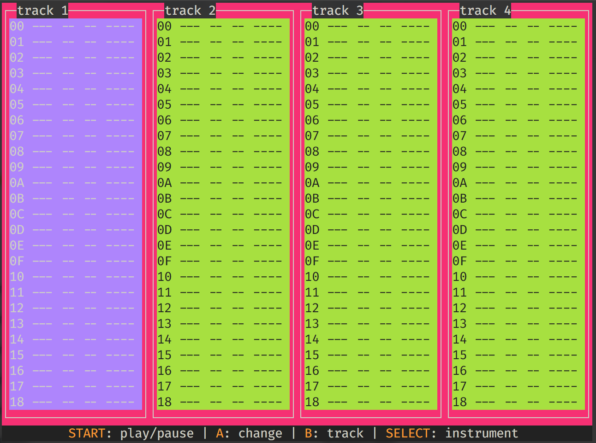

A text-based music-tracker designed to run on a PiGrrl

This is a simple-control-driven interface (just the buttons on a nintendo-style controller) that can run on a low-end machine (runs great on pi.)

